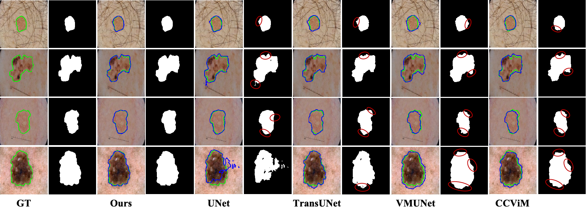
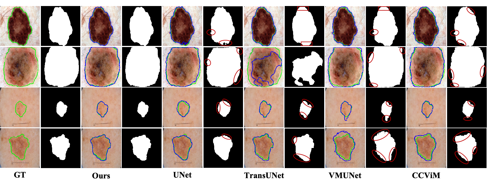
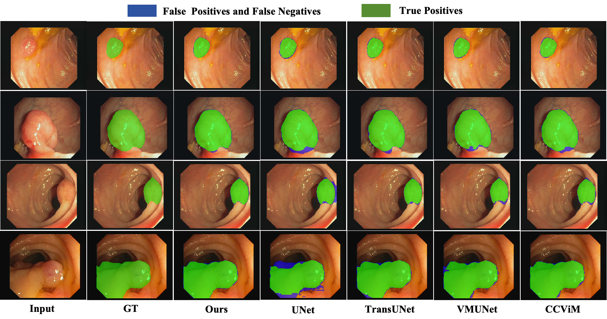
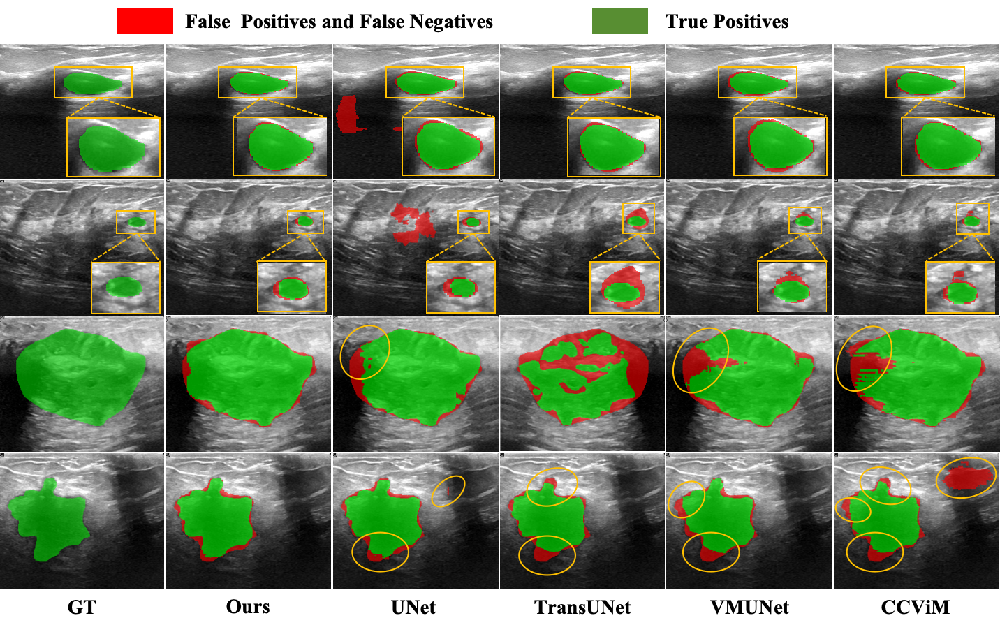

# WFDViM

This is the official code repository for **"WFDViM: Wavelet Frequency-Decoupled Vision Mamba for Robust Weak-Boundary Medical Image Segmentation"**.

## Abstract

Automatic medical image segmentation remains challenging when lesions or anatomical targets exhibit weak boundaries, low contrast, heterogeneous morphology, and strong noise interference. Existing convolutional, Transformer-based, and state-space segmentation networks have improved global representation learning, but many of them process mixed-frequency features uniformly, which may introduce redundant long-range propagation and weaken the recovery of fine boundary structures. This study presents WFDViM, a wavelet frequency-decoupled Vision Mamba framework for robust weak-boundary medical image segmentation. The encoder explicitly separates low-frequency semantic information and high-frequency structural details through discrete wavelet decomposition. Low-frequency components are assigned to structure-aware state-space modeling to capture global context while preserving two-dimensional spatial consistency, whereas high-frequency components are refined by a learnable anisotropic diffusion mechanism to suppress speckle noise, specular reflections, and texture disturbances while retaining meaningful contour cues. In the decoder, a lightweight mask-aware prior and wavelet-guided attention module use denoising-constrained high-frequency geometric information to calibrate skip-connection features during multi-scale upsampling. Experiments are conducted on four public datasets covering dermoscopy, endoscopy, and ultrasound images, including ISIC 2017, ISIC 2018, CVC-ClinicDB, and BUSI. WFDViM achieves Dice scores of 89.80%, 90.33%, 93.73%, and 85.20%, respectively, with 13.06M parameters and 3.05 GFLOPs.

## Visual Results

### Visual results on ISIC 2017

<p align="center">
  
</p>

### Visual results on ISIC 2018

<p align="center">
  
</p>

### Visual results on CVC-ClinicDB

<p align="center">
  
</p>

### Visual results on BUSI

<p align="center">
  
</p>

## Environment Setup

Create and activate a conda environment:

```bash
conda create -n wfdvim python=3.10
conda activate wfdvim
```

Install the Python dependencies:

```bash
pip install -r requirements.txt
```

Install the custom CUDA kernels from the repository root:

```bash
cd kernels/selective_scan
pip install .

cd ../dwconv2d
python3 setup.py install --user
```

## Dataset Preparation

The current release provides an ISIC training configuration. CVC-ClinicDB and BUSI can be organized with the same image-mask folder format if users extend the dataset configuration.

### ISIC datasets

The ISIC 2017 and ISIC 2018 datasets can be downloaded from the [ISIC Challenge data page](https://challenge.isic-archive.com/data/). After downloading a dataset, organize the files as follows:

```text
/path/to/ISIC/
  train/
    images/
      xxx.png
    masks/
      xxx.png
  val/
    images/
      xxx.png
    masks/
      xxx.png
```

Then set the dataset path in `config/tiny_config_isic.py`:

```python
data_path = "/path/to/ISIC/"
```

### CVC-ClinicDB

CVC-ClinicDB is a colonoscopy polyp segmentation dataset released by the Polytechnic University of Catalonia. It can be organized as:

```text
/path/to/CVC-ClinicDB/
  train/
    images/
    masks/
  val/
    images/
    masks/
```

### BUSI

The Breast Ultrasound Images (BUSI) dataset provides ultrasound image-mask pairs for breast lesion segmentation. Benign and malignant samples with lesion masks can be organized as:

```text
/path/to/BUSI/
  train/
    images/
    masks/
  val/
    images/
    masks/
```

## Training

Run the training script from the repository root:

```bash
python tiny_train_isic.py
```

Training logs, checkpoints, and outputs are saved under:

```text
results/
```

The best model checkpoint is saved as:

```text
results/WFDViM_isic_xxxxx/checkpoints/best_model.pth
```

## Main Files

```text
config/tiny_config_isic.py    ISIC training configuration
datasets/dataset.py           Dataset loading and basic transforms
models/wfdvim/                WFDViM model implementation
models/wavelet/               Wavelet transform and frequency decoupling modules
kernels/                      Custom CUDA kernels
tiny_train_isic.py            Training entry
engine.py                     Training and validation loops
utils.py                      Losses, logging, and utilities
```

## Citation

The paper is currently under submission. Citation information will be updated after publication.

## Acknowledgments

This repository is built upon and inspired by several excellent open-source projects, including [VM-UNet](https://github.com/JCruan519/VM-UNet), [TinyViM](https://github.com/xwmaxwma/TinyViM), [Spatial-Mamba](https://github.com/EdwardChasel/Spatial-Mamba), [VMamba](https://github.com/MzeroMiko/VMamba), and [Swin-UNet](https://github.com/HuCaoFighting/Swin-Unet). We thank the authors for their public implementations.
